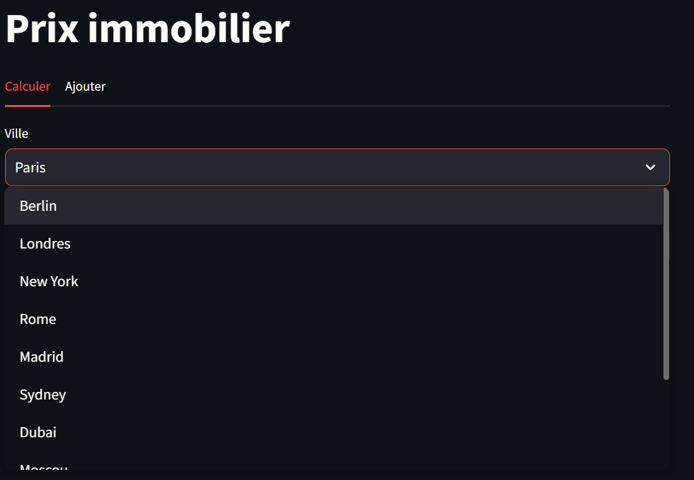
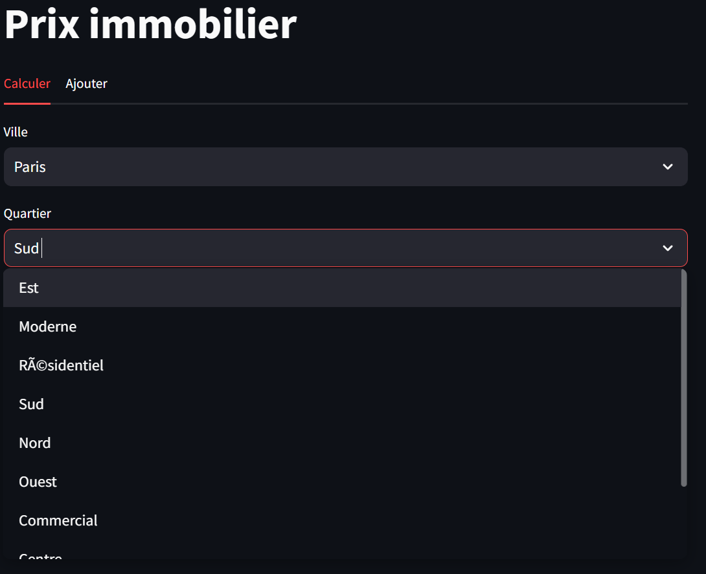
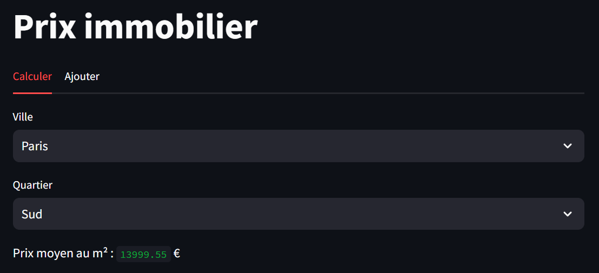
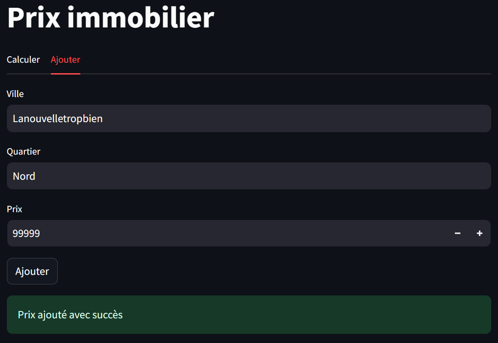
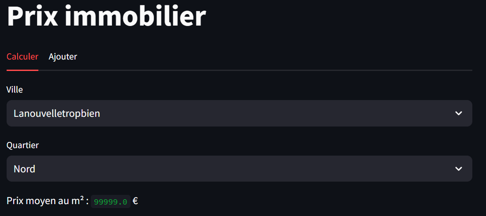

### Participants
* [HARNOIS Corentin]
* [MARIE Anaël]


# Projet Prix Immobilier

Application web pour consulter les prix immobilier pour chaque ville en fonction des quartiers.

## Installation

Assurez-vous que Python est installé sur votre système avant de commencer. Vous pouvez télécharger Python à partir de [python.org](https://www.python.org/).

Pour installer les dépendances requises pour votre projet, exécutez la commande suivante :

```
pip install -r requirements.txt
```

Cela installera toutes les bibliothèques Python nécessaires qui sont listées dans le fichier `requirements.txt`.

## Lancement de l'API

Pour lancer l'API REST, exécutez la commande suivante dans le terminal:

```
python API_Rest.py
```

Assurez-vous que vous êtes dans le répertoire correct où se trouve le fichier `API_Rest.py` avant d'exécuter la commande.

## Lancement du Client Web

Le client web est construit avec Streamlit. Pour le démarrer, utilisez la commande suivante :

```
streamlit run webClient.py
```

L'interface web sera alors accessible via votre navigateur à l'adresse indiquée dans le terminal (par exemple, `http://localhost:8501`).

## Tests

Pour exécuter les tests de l'API, utilisez la commande suivante :
```
python test_api.py
```

Pour exécuter les tests en utilisant pytest, utilisez la commande suivante :
```
pytest
```

## API

L'API ImmoData fournit des informations sur les prix immobiliers dans différentes villes et quartiers. Vous pouvez accéder à des données telles que la liste des villes, les quartiers d'une ville spécifique, et les prix des quartiers.

### **Endpoints disponibles**
#### 1. Récupérer la liste des villes
* Endpoint: /villes
* Méthode: GET
* Description: Récupère la liste complète des villes disponibles dans la base de données.

#### 2. Récupérer les quartiers d'une ville

* Endpoint: /ville/<string\:ville>
* Méthode: GET
* Description: Récupère la liste des quartiers de la ville spécifiée.

#### 3. Récupérer les prix d'un quartier dans une ville

* Endpoint: /ville/<string\:ville>/<string\:quartier>
* Méthode: GET
* Description: Récupère les prix immobiliers pour un quartier spécifique dans une ville donnée.

#### 4. Ajouter un prix pour un quartier dans une ville

* Endpoint: /ville
* Méthode: POST
* Description: Ajoute un prix immobilier pour un quartier spécifique dans une ville donnée. Les données JSON requises dans le corps de la requête sont ville, quartier, et prix.


### Exemple de requête POST pour ajouter un prix
    
```json
{
    "ville": "Paris",
    "quartier": "Batignolles",
    "prix": 10000
}
```
# Interface Web
L'interface web de notre application est construite avec Streamlit, un framework Python pour la création d'applications web. Elle permet aux utilisateurs de consulter les prix immobiliers pour chaque ville en fonction des quartiers.

Voici comment elle fonctionne :
1. **Choisir une ville** : Lorsque vous lancez l'application, la première chose que vous verrez est un menu déroulant pour sélectionner une ville. Sélectionnez la ville pour laquelle vous souhaitez consulter les prix immobiliers.

<div style="text-align:center">
    
</div>

2. **Choisir un quartier** : Une fois que vous avez sélectionné une ville, un autre menu déroulant apparaîtra pour sélectionner un quartier dans la ville choisie.

<div style="text-align:center">
    
</div>

3. **Visualiser les prix immobiliers** : Après avoir sélectionné un quartier, l'application affichera les prix immobiliers pour le quartier sélectionné.

<div style="text-align:center">
    
</div>

4. **Ajouter une nouvelle ville** : Vous pouvez également ajouter une nouvelle ville et ses quartiers en utilisant le formulaire de soumission en bas de l'application.

<div style="text-align:center">
    
</div>

5. **Visualiser la nouvelle ville dans la base de données** : Après avoir ajouté une nouvelle ville, vous pouvez la visualiser dans la base de données. L'image ci-dessous montre comment une nouvelle ville apparaît dans la base de données.

<div style="text-align:center">
    
</div>